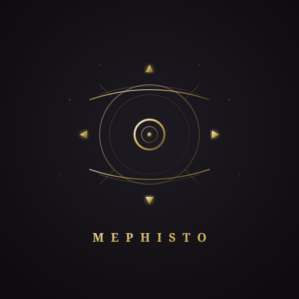

<p align="center">
  
</p>

# Mephisto

> **Long-form narrative engine — driving rules and LLMs with plain-text contract files.**

<p align="center">
  <i>"Mephisto seals the pact with you."</i>
</p>

<p align="center">
  
  
  
  <a href="./README.md"></a>
</p>

---

## 📌 Project Status

> ⚠️ **Transitional Version Notice**

**This repository (CLI edition) is the Go command-line transitional version of Mephisto.**

- 🎯 **Primary version**: [Mephisto Flutter edition](https://github.com/yuelinghuashu/mephisto-gui) — a cross-platform GUI app (Windows / macOS / Linux / Android / iOS) with a complete graphical narrative experience (in-app editor, rule hot-reload, custom style rules, multi-platform contract storage). It is the **primary development target**.
- ⏳ **Transitional role**: The CLI edition is used to quickly validate the core engine logic and command-line usage scenarios. Once its features are aligned with the Flutter edition, the CLI edition will **enter maintenance mode** (bug fixes and change synchronization only) and will not introduce major feature changes.
- 🔗 **Compatibility**: Both editions share the same `.meph` contract syntax and narrative engine design; contract files are fully compatible.

---

## ✨ What is this?

Mephisto is a **long-form narrative engine**. It reads plain-text `.meph` contract files, parses them into structured data, drives a rule engine for conditional logic, and calls LLMs to generate streaming narratives.

**Core capabilities**:

- 📜 **Contract-driven**: Define blocks with `【】`, states with `-`, behaviors with `[rules]`
- ⚡ **Rule engine**: Condition evaluation, logical operators, dice expressions (`roll(1d100)`), custom thresholds (`roll(1d100) >= 80`), mutual exclusion groups, compound assignment (`状态.堕落指数 += 10`), two-phase execution (passive rules batch + active rules exclusive match)
- 🧠 **LLM integration**: Dice results influence narrative generation, streaming output, conversation history management
- 💾 **Memory weaving**: Intelligent key event extraction, automatic compression and summarization, long-term memory persistence
- 📂 **Child save system**: Auto-save every round, multi-branch storylines, run child saves directly for auto-overwrite
- 🎯 **Fate perspective**: You are "Fate" (the driver of the narrative), input commands to drive the character's actions
- 🎲 **Dice transparency**: Every roll result is displayed to the user in real time: rule name + value + ✅/❌ at a glance
- 🔌 **VS Code extension**: Syntax highlighting, real-time diagnostics, code completion, hover tips, formatting, outline view — [install from Marketplace](https://marketplace.visualstudio.com/items?itemName=yuelinghuashu.vscode-mephisto)
- ♻️ **Hot-reload rules**: Edit the child save file and save — changes apply automatically without exiting the conversation. Works best with the VS Code extension. Type `/rules` anytime to see the current rule details

---

## ⚖️ Quick Start

### 1. Configure an LLM Backend

Mephisto supports three LLM backends. Choose one.

#### Option A: DeepSeek (recommended, works out of the box)

Create a `.env` file in the project root:

```bash
MEPHISTO_CLIENT=openai
MEPHISTO_MODEL=deepseek-v4-flash
OPENAI_API_KEY=sk-your-deepseek-key
```

#### Option B: OpenAI

```bash
MEPHISTO_CLIENT=openai
MEPHISTO_MODEL=gpt-4o-mini
OPENAI_API_KEY=sk-your-openai-key
```

#### Option C: Ollama (fully offline, free)

```bash
MEPHISTO_CLIENT=ollama
MEPHISTO_MODEL=llama3.2
# No API key needed. Make sure Ollama is running: ollama serve
```

> **Note**: You can also pass these parameters directly via CLI. Priority: **CLI args > environment variables > `.env` file**.

### 2. Build and Run

```bash
# Build
go build -o ./mephisto ./cmd/mephisto

# Or simply
make build

# Generate a sample contract
./mephisto init

# Run
./mephisto run data/faust.meph

# Or with make
make run
```

### 3. Interaction Example

> The output below uses the `--constraints` custom constraint option; the LLM follows the format requirements specified in the constraint file.

```text
命运 > 你与梅菲斯特展开了一场关于真理的论道
　　（书斋四壁，羊皮卷轴堆积如山。烛火摇曳，将浮士德的影子撕成两半）

　　浮士德：
　　这扭曲的影子啊！左边是学问堆积的尸骨，
　　右边——（抓起一面铜镜）这镜中的陌生人是谁？
　　他对我微笑，用我千日的疲倦，
　　却眨着地狱才有的硫磺色瞳孔！
...
```

---

## 🎭 Multi-branch Storylines

Mephisto supports multiple branches within the same story world:

```bash
# Default child save (mainline)
./mephisto run data/faust.meph

# Specify a branch
./mephisto run data/faust.meph --branch dark

# Ignore child save, restart from the master
./mephisto run data/faust.meph --reset

# Combined
./mephisto run data/faust.meph --reset --branch dark
```

---

## 📚 Documentation

> The contract is signed. Let each clause be read aloud.

| Document | Description |
| -------- | ----------- |
| **[Syntax Manual](./docs/SYNTAX.md)** (Chinese) | How to write `.meph` contracts |
| **[Rule Engine Deep Dive](./docs/RULES.md)** (Chinese) | The gears and laws that drive the narrative |
| **[Example Contract](./data/faust.meph)** | Faust's complete contract |
| **[VS Code Extension](https://marketplace.visualstudio.com/items?itemName=yuelinghuashu.vscode-mephisto)** | Syntax highlighting, diagnostics, completion, formatting |

---

## 🛠️ CLI Options

<details>
<summary>📖 View full CLI options</summary>

```bash
./mephisto <subcommand> [options] <file>
./mephisto <file>                   # Shorthand, equivalent to parse

Subcommands:
  init  [template]             Generate a sample contract file (faust / dantes, default: faust)
  parse <file> [options]       Parse a .meph contract, output JSON
  run   <file> [options]       Start an interactive conversation
  version                      Show version info
  help                         Show this help

Conventions:
  -<letter>                    Short option (e.g., -b, -o, -q)
  --<word>                     Long option (e.g., --branch, --output)
                               Long options must use double dashes

Common options:
  -h, --help                   Show help

parse options:
  -o, --output <path>          Output to file (default: stdout)
  -q, --quiet                  Quiet mode, only print errors

run options:
  -b, --branch <name>          Branch name (for multi-branch storylines)
  -r, --reset                  Ignore child save, restart from master
  -d, --debug                  Enable rule debug mode
  -c, --client <type>          LLM client: openai (OpenAI-compatible, incl. DeepSeek) / ollama
  -m, --model <name>           Model name
      --api-key <key>          API key
      --base-url <url>         API base URL
      --constraints <file>     Custom constraint file (default: built-in constraints)
      --max-tokens <n>         Max generated tokens (default: 4096)
  -q, --quiet                  Quiet mode

Interactive mode commands:
  /state                       Show current state
  /history                     Show conversation history
  /rules                       Show current rules
  /save                        Save progress manually
  exit / quit / q              Exit the conversation

Environment variables:
  OPENAI_API_KEY               API key (lower priority than CLI args)
  OPENAI_BASE_URL              API base URL
  MEPHISTO_MODEL               Model name
  MEPHISTO_CLIENT              Client type (openai/ollama; DeepSeek uses the openai client via BaseURL)
  MEPHISTO_BRANCH              Default branch name
  MEPHISTO_DEBUG               Enable debug mode
  MEPHISTO_RESET               Ignore child save
  MEPHISTO_QUIET               Quiet mode
```

</details>

---

## 📁 Project Structure

```text
mephisto/
├── cmd/
│   └── mephisto/          # CLI entry point (config + commands + session + help)
├── internal/
│   ├── core/              # Core layer
│   │   ├── parser/        # Contract parser (lexer + parser + parse_block)
│   │   ├── engine/        # Narrative engine (engine + dice + condition + matcher + executor + runtime + memory + save)
│   │   ├── llm/           # LLM clients (openai + ollama + prompt)
│   │   └── integration/   # Integration tests
│   ├── domain/            # Domain models (Contract, Rule, HistoryEntry)
│   └── shared/            # Shared utilities (convert.go, errors.go)
├── data/                  # Example contract files
├── docs/                  # Documentation (Chinese)
└── assets/                # Logo assets
```

---

## 📦 Requirements

- Go 1.26+

---

## 📝 Changelog

See [CHANGELOG.md](./CHANGELOG.md)

---

## 🎭 About the Name

Mephisto is named after Mephistopheles, the devil from Goethe's *Faust*.

In *Faust*, Faust pursues relentlessly but is never truly satisfied. Only at the end of his life, hearing the sound of shovels and believing he is building a new world for his people, does he utter **"Verweile doch, du bist so schön!"** ("Stay a while, you are so beautiful!") — and falls dead.

Mephisto is **not a demon, not a guardian**.  
It is the **mechanism that keeps the narrative going**.

> **It sets conditions, but never stops you from moving forward.**  
> **It keeps you walking, until you yourself say:**  
> **"This is enough. I am content."**

---

## 📄 License

MIT
